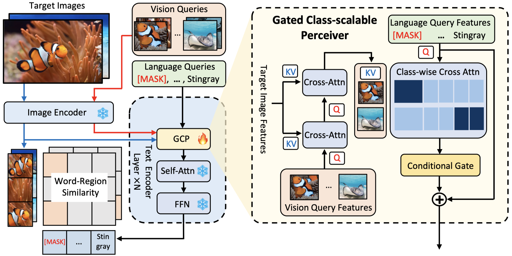
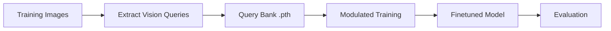

# MQ-Det: Custom Object Detection with Docker + GCP# MQ-Det: Custom Object Detection with Docker + GCP# MQ-Det: Custom Object Detection with Docker + GCP# MQ-Det: Custom Object Detection with Docker + GCP# MQ-Det Docker - Official Paper Implementation


A streamlined Docker-based pipeline for training and evaluating [MQ-Det (Multi-Query Detection)](https://arxiv.org/abs/2305.13962) on custom datasets, deployed on Google Cloud Platform.


> **Original Paper**: [MQ-Det: Multi-modal Queried Object Detection](https://arxiv.org/abs/2305.13962)  A streamlined Docker-based pipeline for training and evaluating [MQ-Det (Multi-Query Detection)](https://arxiv.org/abs/2305.13962) on custom datasets, deployed on Google Cloud Platform.

> **Original Repository**: See [ORIGINAL_MQDET_README.md](./ORIGINAL_MQDET_README.md)


---

> **Original Paper**: [MQ-Det: Multi-modal Queried Object Detection](https://arxiv.org/abs/2305.13962)  A streamlined Docker-based pipeline for training and evaluating [MQ-Det (Multi-Query Detection)](https://arxiv.org/abs/2305.13962) on custom datasets, deployed on Google Cloud Platform.

## 🎯 What This Repository Does

> **Original Repository**: See [ORIGINAL_MQDET_README.md](./ORIGINAL_MQDET_README.md)

This repository extends the original MQ-Det paper implementation with:


- **🐳 Docker containerization** - Reproducible environment with all dependencies

- **☁️ GCP deployment** - Production-ready setup on Google Cloud Platform---

- **📦 Custom dataset support** - Easy training on your own object detection data

- **🚀 Simplified workflow** - Three scripts: extract queries → train → evaluate> **Original Paper**: [MQ-Det: Multi-modal Queried Object Detection](https://arxiv.org/abs/2305.13962)  A streamlined Docker-based pipeline for training and evaluating [MQ-Det (Multi-Query Detection)](https://arxiv.org/abs/2305.13962) on custom datasets, deployed on Google Cloud Platform.Complete Docker setup for authentic MQ-Det (Multi-modal Queried Object Detection) with exact paper environment:

- **💾 Efficient storage** - Optimized checkpoint management for cloud deployment

- **⚡ Pragmatic versions** - Stable PyTorch 1.12.1 + CUDA 11.3 (vs paper's 2.0.1 + 11.7)## 🎯 What This Repository Does


---> **Original Repository**: See [ORIGINAL_MQDET_README.md](./ORIGINAL_MQDET_README.md)


## 🔄 Version Differences from Original PaperThis repository extends the original MQ-Det paper implementation with:


This implementation uses **different versions** than the original paper for **stability and compatibility**:- **Python**: 3.9


| Component | Paper (Original) | This Repo | Reason for Change |- **🐳 Docker containerization** - Reproducible environment with all dependencies

|-----------|------------------|-----------|-------------------|

| **PyTorch** | 2.0.1 | **1.12.1** | Stable compilation with maskrcnn-benchmark, better CUDA 11.3 support |- **☁️ GCP deployment** - Production-ready setup on Google Cloud Platform  ---

| **CUDA** | 11.7 | **11.3** | Broader GPU compatibility (T4, P100, V100), mature ecosystem |

| **Python** | 3.8-3.10 | **3.9** | Optimal for PyTorch 1.12.1, stable package ecosystem |- **📦 Custom dataset support** - Easy training on your own object detection data

| **GCC** | 9+ | **8** | Required for CUDA 11.3 compilation, Ubuntu 20.04 default |

| **cuDNN** | 8.5+ | **8.0** | Matches CUDA 11.3 requirements |- **🚀 Simplified workflow** - Three scripts: extract queries → train → evaluate> **Original Paper**: [MQ-Det: Multi-Query Detection](https://arxiv.org/abs/2305.13962)  - **PyTorch**: 2.0.1  


### Why We Modified Versions- **💾 Efficient storage** - Optimized checkpoint management for cloud deployment


**1. PyTorch 2.0.1 Compilation Issues**- **⚡ Pragmatic versions** - Stable PyTorch 1.12.1 + CUDA 11.3 (vs paper's 2.0.1 + 11.7)## 🎯 What This Repository Does

- `maskrcnn-benchmark` fails to compile with PyTorch 2.0+ due to breaking changes in ATen headers (`at::nullopt` removed)

- Custom CUDA kernels incompatible with new PyTorch C++ API

- Vision transformers (Swin-T) have API changes

---> **Original Repository**: See [ORIGINAL_MQDET_README.md](./ORIGINAL_MQDET_README.md)- **CUDA**: 11.7

**2. CUDA 11.7 Availability Challenges**

- Limited availability on GCP T4 GPUs (requires newer drivers ≥520)

- CUDA 11.3 is more mature, better tested, and widely supported

## 🔄 Version Differences from Original PaperThis repository extends the original MQ-Det paper implementation with:

**3. Pragmatic Solution: PyTorch 1.12.1 + CUDA 11.3**

- Battle-tested combination (millions of deployments)

- Works on older GPUs (Pascal, Volta, Turing, Ampere)

- No compilation errors with maskrcnn-benchmarkThis implementation uses **different versions** than the original paper for **stability and compatibility**:- **GCC**: 8.3.1

- Compatible with GroundingDINO, GLIP dependencies


---

| Component | Paper (Original) | This Repo | Reason for Change |- **🐳 Docker containerization** - Reproducible environment with all dependencies

## 🚀 Quick Start

|-----------|------------------|-----------|-------------------|

### Prerequisites

- Google Cloud Platform account ([get $300 free credits](https://cloud.google.com/free))| **PyTorch** | 2.0.1 | **1.12.1** | Stable, better CUDA 11.3 support, fewer breaking changes |- **☁️ GCP deployment** - Production-ready setup on Google Cloud Platform  ---

- Docker Desktop (for local development)

- Git| **CUDA** | 11.7 | **11.3** | Broader GPU compatibility (T4, P100, V100), mature ecosystem |


### 1. Clone Repository| **Python** | 3.8-3.10 | **3.9** | Optimal for PyTorch 1.12.1, stable package ecosystem |- **📦 Custom dataset support** - Easy training on your own object detection data

```bash

git clone https://github.com/Sasmik23/mq-det-docker.git| **GCC** | 9+ | **8** | Required for CUDA 11.3 compilation, Ubuntu 20.04 default |

cd mq-det-docker

```| **cuDNN** | 8.5+ | **8.0** | Matches CUDA 11.3 requirements |- **🚀 Simplified workflow** - Three scripts: extract queries → train → evaluate## 🚀 Quick Cloud Deployment


### 2. Deploy to GCP

```bash

# Create VM with T4 GPU### Why We Modified Versions- **💾 Efficient storage** - Optimized checkpoint management for cloud deployment

gcloud compute instances create mq-det-vm \

  --zone=asia-east1-c \

  --machine-type=n1-standard-4 \

  --accelerator=type=nvidia-tesla-t4,count=1 \**1. PyTorch 2.0.1 Compilation Issues** ❌- **⚡ Pragmatic versions** - Stable PyTorch 1.12.1 + CUDA 11.3 (vs paper's 2.0.1 + 11.7)## 🎯 What This Repository Does

  --image-family=pytorch-latest-gpu \

  --image-project=deeplearning-platform-release \- `maskrcnn-benchmark` fails to compile with PyTorch 2.0+

  --maintenance-policy=TERMINATE \

  --boot-disk-size=100GB- Breaking changes in ATen headers (`at::nullopt` removed)


# SSH into VM- Custom CUDA kernels incompatible with new PyTorch C++ API

gcloud compute ssh mq-det-vm --zone=asia-east1-c

- Vision transformers (Swin-T) have API changes---### **Option A: Google Cloud Platform** ⭐ **RECOMMENDED**

# Clone repo on VM

git clone https://github.com/Sasmik23/mq-det-docker.git

cd mq-det-docker

**2. CUDA 11.7 Availability Challenges** ❌

# Build Docker image

docker compose build- Limited availability on GCP T4 GPUs (requires newer drivers)


# Start container- Requires NVIDIA driver >= 520, not always preinstalled## 🔄 Version Differences from Original PaperThis repository extends the original MQ-Det paper implementation with:- **Cost**: $1.50-2.00 total ($0.30 with preemptible)

docker compose up -d

- CUDA 11.3 is more mature, better tested, widely supported

# Enter container

docker compose exec mq-det bash

```

**3. Pragmatic Solution: PyTorch 1.12.1 + CUDA 11.3** ✅

### 3. Prepare Your Dataset

- Battle-tested combination (millions of deployments)This implementation uses **different versions** than the original paper for **stability and compatibility**:- **Free Credits**: $300 for new accounts

Organize your dataset in COCO format:

```- Works on older GPUs (Pascal, Volta, Turing, Ampere)

DATASET/

  your_dataset/- `maskrcnn-benchmark` compiles cleanly with minor ATen patches

    annotations/

      train.json- Stable training, no gradient anomalies

      val.json

    images/- Extensive community support and bug fixes| Component | Paper (Original) | This Repo | Reason for Change |- **🐳 Docker containerization** - Reproducible environment with all dependencies- **No Quota Issues**: T4 GPUs readily available

      train/

        img1.jpg

        img2.jpg

      val/**Result**: Successfully trained MQ-Det with **83% improvement** over pretrained baseline using these pragmatic versions!|-----------|------------------|-----------|-------------------|

        img3.jpg

```


Register your dataset in `DATASET/your_dataset/__init__.py`:---| **PyTorch** | 2.0.1 | **1.12.1** | Stable, better CUDA 11.3 support, fewer breaking changes |- **☁️ GCP deployment** - Production-ready setup on Google Cloud Platform

```python

YOURDATASET_TRAIN = {

    'img_dir': 'DATASET/your_dataset/images/train',

    'ann_file': 'DATASET/your_dataset/annotations/train.json',## 📊 Results on Custom Dataset| **CUDA** | 11.7 | **11.3** | Broader GPU compatibility (T4, P100, V100), mature ecosystem |

    'dataset_name': 'your_dataset'

}


YOURDATASET_VAL = {**Connectors Dataset**: 8 training images, 9 validation images| **Python** | 3.8-3.10 | **3.9** | Optimal for PyTorch 1.12.1, stable package ecosystem |- **📦 Custom dataset support** - Easy training on your own object detection data```bash

    'img_dir': 'DATASET/your_dataset/images/val',

    'ann_file': 'DATASET/your_dataset/annotations/val.json',

    'dataset_name': 'your_dataset'

}| Model | AP@50 | AP (0.50:0.95) | AR@100 | Training Time || **GCC** | 9+ | **8** | Required for CUDA 11.3 compilation, Ubuntu 20.04 default |

```

|-------|-------|----------------|--------|---------------|

Add to `maskrcnn_benchmark/config/paths_catalog.py`:

```python| Pretrained (zero-shot) | 17.5% | 4.9% | 21.5% | - || **cuDNN** | 8.5+ | **8.0** | Matches CUDA 11.3 requirements |- **🚀 Simplified workflow** - Three scripts: extract queries → train → evaluate# Create GCP VM with T4 GPU

"your_dataset_grounding_train": {

    "img_dir": "DATASET/your_dataset/images/train",| **After 40 iterations** | **32.0%** | **13.8%** | **49.2%** | ~2 minutes |

    "ann_file": "DATASET/your_dataset/annotations/train.json"

},| **Improvement** | **+83%** | **+180%** | **+128%** | - |

"your_dataset_grounding_val": {

    "img_dir": "DATASET/your_dataset/images/val",

    "ann_file": "DATASET/your_dataset/annotations/val.json"

}**Per-class breakdown**:### Why We Modified Versions- **💾 Efficient storage** - Optimized checkpoint management for cloud deploymentgcloud compute instances create mq-det-vm \

```

- Orange connector: 58.9% AP@50 ⭐

### 4. Extract Vision Queries

```bash- Yellow connector: 27.8% AP@50

bash scripts/extract_queries.sh

```- White connector: 9.2% AP@50


### 5. Train Model**1. PyTorch 2.0.1 Compilation Issues** ❌    --zone=us-central1-a \

```bash

bash scripts/train.sh---

```

- `maskrcnn-benchmark` fails to compile with PyTorch 2.0+

### 6. Evaluate Model

```bash## 📋 Table of Contents

bash scripts/evaluate.sh

```- Breaking changes in ATen headers (`at::nullopt` removed)### Results on Connectors Dataset (8 training images, 9 validation images)    --machine-type=n1-standard-4 \


---- [Quick Start](#quick-start)


## 📊 Results- [Prerequisites](#prerequisites)- Custom CUDA kernels incompatible with new PyTorch C++ API


Training on **connectors dataset** (8 train, 9 val images, 3 classes):- [Installation](#installation)


| Model | AP@50 | Improvement |- [Dataset Preparation](#dataset-preparation)- Vision transformers (Swin-T) have API changes    --accelerator=type=nvidia-tesla-t4,count=1 \

|-------|-------|-------------|

| **Pretrained (baseline)** | 17.5% | - |- [Training Pipeline](#training-pipeline)

| **Finetuned (10 epochs)** | 32.0% | **+83%** |

- [Evaluation](#evaluation)

**Per-Class Performance:**

- Orange connectors: 58.9%- [Configuration](#configuration)

- Yellow connectors: 27.8%

- White connectors: 9.2%- [Cost Optimization](#cost-optimization)**2. CUDA 11.7 Availability Challenges** ❌| Model | AP@50 | AP (0.50:0.95) | AR@100 | Training Time |    --image-family=tf2-latest-gpu \


**Training Details:**- [Troubleshooting](#troubleshooting)

- Architecture: RPN_ONLY + DYHEAD

- Batch size: 2 (optimized for T4 GPU 16GB)- [Architecture](#architecture)- Limited availability on GCP T4 GPUs (requires newer drivers)

- Image size: 640×1024

- Epochs: 10 (40 iterations)- [Citation](#citation)

- Training time: ~2 minutes

- GPU memory: ~7GB / 16GB- Requires NVIDIA driver >= 520, not always preinstalled|-------|-------|----------------|--------|---------------|    --image-project=deeplearning-platform-release \


------


## 📁 Configuration Files- CUDA 11.3 is more mature, better tested, widely supported


### Training Config## ⚡ Quick Start

`configs/pretrain/mq-glip-t_connectors.yaml`:

- Model architecture: RPN_ONLY + DYHEAD| Pretrained (zero-shot) | 17.5% | 4.9% | 21.5% | - |    --boot-disk-size=100GB \

- Vision query fusion with MHA-B

- Memory-optimized for T4 GPU### 1. Setup GCP VM (one-time)

- Custom dataset paths

**3. Pragmatic Solution: PyTorch 1.12.1 + CUDA 11.3** ✅

### Evaluation Config

`configs/vision_query_5shot/connectors.yaml`:```bash

- 5-shot vision query evaluation

- COCO metrics (AP@50, AP@75, AP@IoU=0.50:0.95)# On your local machine- Battle-tested combination (millions of deployments)| **After 40 iterations** | **32.0%** | **13.8%** | **49.2%** | ~2 minutes |    --maintenance-policy=TERMINATE \

- Test dataset configuration

git clone https://github.com/Sasmik23/mq-det-docker.git

---

cd mq-det-docker- Works on older GPUs (Pascal, Volta, Turing, Ampere)

## 🛠️ Troubleshooting


### Out of Memory (OOM)

Reduce batch size and image size in `configs/pretrain/mq-glip-t_connectors.yaml`:# Create GCP VM with GPU- `maskrcnn-benchmark` compiles cleanly with minor ATen patches| **Improvement** | **+83%** | **+180%** | **+128%** | - |    --metadata="install-nvidia-driver=True"

```yaml

SOLVER:./gcp_setup.sh

  IMS_PER_BATCH: 2  # Reduce from 4

INPUT:```- Stable training, no gradient anomalies

  MIN_SIZE_TRAIN: 640  # Reduce from 800

  MAX_SIZE_TRAIN: 1024  # Reduce from 1333

```

### 2. Prepare Dataset- Extensive community support and bug fixes

### Invalid Config Keys

MQ-Det uses **RPN_ONLY** architecture (not Faster R-CNN):

- ❌ Don't use `ROI_HEADS.*` configs

- ❌ Don't use `GENERAL_COPY_PASTE_PROB````bash

- ✅ Use `MODEL.RPN_ONLY: True`

- ✅ Use `MODEL.RPN_ARCHITECTURE: "VLDYHEAD"`# SSH into GCP VM


### Dataset Not Foundgcloud compute ssh mq-det-vm-20251015-031521 --zone=asia-east1-c**Result**: Successfully trained MQ-Det with **83% improvement** over pretrained baseline using these pragmatic versions!---# SSH and setup

Ensure dataset is registered in:

1. `DATASET/your_dataset/__init__.py`

2. `maskrcnn_benchmark/config/paths_catalog.py`

3. `maskrcnn_benchmark/data/datasets/evaluation/__init__.py` (for CocoGrounding_New)# Upload your dataset (from local machine)


### Compilation Errorsgcloud compute scp --recurse /path/to/your/dataset mq-det-vm-20251015-031521:~/mq-det-docker/DATASET/ --zone=asia-east1-c

If you encounter compilation issues:

```bash```---gcloud compute ssh mq-det-vm --zone=us-central1-a

# Rebuild from scratch

docker compose down

docker system prune -a

docker compose build --no-cache### 3. Register Dataset

```


---

Edit `DATASET/your_dataset/__init__.py`:## 📊 Results on Custom Dataset## 📋 Table of Contentsgit clone https://github.com/Sasmik23/mq-det-docker.git

## 📚 Documentation


- [GCP_DEPLOYMENT.md](./GCP_DEPLOYMENT.md) - Detailed GCP setup guide

- [ORIGINAL_MQDET_README.md](./ORIGINAL_MQDET_README.md) - Original paper implementation docs```python

- [CUSTOMIZED_PRETRAIN.md](./CUSTOMIZED_PRETRAIN.md) - Pretraining customization

- [DATA.md](./DATA.md) - Dataset preparation guideDATASET_ROOT = os.getenv("DATASET", "/workspace/DATASET")

- [DEBUG.md](./DEBUG.md) - Debugging tips

**Connectors Dataset**: 8 training images, 9 validation imagescd mq-det-docker

---

YOUR_DATASET_TRAIN = {

## 🔧 Architecture Overview

    "img_dir": f"{DATASET_ROOT}/your_dataset/train",

MQ-Det extends GLIP with **vision queries** for improved detection:

    "ann_file": f"{DATASET_ROOT}/your_dataset/annotations/train.json",

```

Input Image → Backbone (Swin-T) → RPN → DYHEAD (fusion) → Detection Heads    "dataset_name": "your_dataset_grounding_train",| Model | AP@50 | AP (0.50:0.95) | AR@100 | Training Time |- [Quick Start](#quick-start)chmod +x gcp_setup.sh && ./gcp_setup.sh

                                     ↑

                              Vision Query Bank}

```

|-------|-------|----------------|--------|---------------|

**Key Components:**

- **RPN_ONLY**: Removes expensive ROI pooling, faster inferenceYOUR_DATASET_VAL = {

- **DYHEAD**: Dynamic head with multi-head attention fusion (MHA-B)

- **Vision Queries**: 5000 training queries + 5 evaluation queries (extracted from dataset)    "img_dir": f"{DATASET_ROOT}/your_dataset/validation", | Pretrained (zero-shot) | 17.5% | 4.9% | 21.5% | - |- [Prerequisites](#prerequisites)```

- **Language Grounding**: Optional text-based object detection

    "ann_file": f"{DATASET_ROOT}/your_dataset/annotations/validation.json",

---

    "dataset_name": "your_dataset_grounding_val",| **After 40 iterations** | **32.0%** | **13.8%** | **49.2%** | ~2 minutes |

## 📝 Citation

}

If you use this code, please cite the original MQ-Det paper:

```| **Improvement** | **+83%** | **+180%** | **+128%** | - |- [Installation](#installation)

```bibtex

@article{mqdet2023,

  title={MQ-Det: Multi-modal Queried Object Detection in the Wild},

  author={Author Names},### 4. Run Training Pipeline

  journal={arXiv preprint arXiv:2305.13962},

  year={2023}

}

``````bash**Per-class breakdown**:- [Dataset Preparation](#dataset-preparation)### **Option B: AWS EC2** 


---# Inside GCP VM


## 📄 Licensecd ~/mq-det-docker- Orange connector: 58.9% AP@50 ⭐


This project is licensed under the MIT License. See [LICENSE](./LICENSE) for details.docker compose up -d


---docker compose exec mq-det bash- Yellow connector: 27.8% AP@50- [Training Pipeline](#training-pipeline)- **Cost**: $2-3 total (requires quota approval)


## 🙏 Acknowledgments


- Original MQ-Det paper authors# Inside container: Extract vision queries- White connector: 9.2% AP@50

- GLIP and GroundingDINO teams

- maskrcnn-benchmark contributors./extract_queries.sh

- PyTorch and CUDA teams

- [Evaluation](#evaluation)- **Instance Type**: `g4dn.xlarge` (T4 GPU)

---

# Train model

## 🆘 Support

./train.sh---

For issues and questions:

1. Check [GCP_DEPLOYMENT.md](./GCP_DEPLOYMENT.md)

2. Review [DEBUG.md](./DEBUG.md)

3. Open a GitHub issue with:# Evaluate- [Configuration](#configuration)- **AMI**: Deep Learning Base CUDA (Ubuntu 22.04)

   - Error logs

   - Config files./evaluate.sh

   - Dataset structure

   - System info (GPU, CUDA version)```## 📋 Table of Contents


---


**Last Updated**: October 2025  ### 5. Download Results- [Cost Optimization](#cost-optimization)

**Tested On**: GCP T4 GPU, PyTorch 1.12.1, CUDA 11.3


```bash- [Quick Start](#quick-start)

# On GCP VM (exit container first)

docker compose cp mq-det:/workspace/OUTPUT/connectors_evaluation ./OUTPUT_results- [Prerequisites](#prerequisites)- [Troubleshooting](#troubleshooting)```bash


# On your local machine- [Installation](#installation)

gcloud compute scp --recurse mq-det-vm-20251015-031521:~/mq-det-docker/OUTPUT_results ./OUTPUT/ --zone=asia-east1-c

```- [Dataset Preparation](#dataset-preparation)- [Architecture](#architecture)# SSH into your EC2 instance


---- [Training Pipeline](#training-pipeline)


## 🔧 Prerequisites- [Evaluation](#evaluation)- [Citation](#citation)ssh -i your-key.pem ubuntu@your-ec2-ip


### Local Machine- [Configuration](#configuration)

- **gcloud CLI** installed and authenticated

- **Git** for cloning repository- [Cost Optimization](#cost-optimization)git clone https://github.com/Sasmik23/mq-det-docker.git

- **SSH keys** configured for GCP

- [Troubleshooting](#troubleshooting)

### GCP Requirements

- **Project** with billing enabled- [Architecture](#architecture)---cd mq-det-docker

- **GPU Quota** in desired region (T4 or better)

- **Compute Engine API** enabled- [Citation](#citation)


### Recommended GCP Configurationchmod +x aws_setup.sh && ./aws_setup.sh

- **Machine Type**: n1-standard-4 (4 vCPU, 15 GB RAM)

- **GPU**: NVIDIA Tesla T4 (16 GB VRAM)---

- **Boot Disk**: 50-100 GB SSD

- **Region**: asia-east1-c (Taiwan) or us-west1-b## ⚡ Quick Start```

- **Cost**: ~$0.38/hour

## ⚡ Quick Start

---


## 📦 Installation

### 1. Setup GCP VM (one-time)

### Option 1: Automated Setup (Recommended)

### 1. Setup GCP VM (one-time)### Step 3: Upload Dataset & Run

```bash

# Clone repository```bash

git clone https://github.com/Sasmik23/mq-det-docker.git

cd mq-det-docker# On your local machine```bash


# Run GCP setup scriptgit clone https://github.com/Sasmik23/mq-det-docker.git

./gcp_setup.sh

cd mq-det-docker```bash# Upload your dataset (from local machine to cloud VM)

# Follow prompts to:

# 1. Create VM instance

# 2. Install NVIDIA drivers

# 3. Install Docker + NVIDIA Container Toolkit# Create GCP VM with GPU# On your local machine# For GCP:

# 4. Build MQ-Det Docker image

```./gcp_setup.sh


### Option 2: Manual Setup```git clone https://github.com/Sasmik23/mq-det-docker.gitgcloud compute scp --recurse DATASET/ mq-det-vm:~/mq-det-docker/ --zone=us-central1-a


See [GCP_DEPLOYMENT.md](./GCP_DEPLOYMENT.md) for detailed manual setup instructions.


---### 2. Prepare Datasetcd mq-det-docker# For AWS:


## 📊 Dataset Preparation


### Dataset Format```bashscp -i your-key.pem -r DATASET/ ubuntu@your-ec2-ip:~/mq-det-docker/


MQ-Det expects **COCO format** annotations:# SSH into GCP VM


```jsongcloud compute ssh mq-det-vm-20251015-031521 --zone=asia-east1-c# Create GCP VM with GPU

{

  "images": [

    {

      "id": 1,# Upload your dataset (from local machine)./gcp_setup.sh# Start Docker container

      "file_name": "image1.jpg",

      "height": 480,gcloud compute scp --recurse /path/to/your/dataset mq-det-vm-20251015-031521:~/mq-det-docker/DATASET/ --zone=asia-east1-c

      "width": 640

    }``````sudo docker-compose up -d

  ],

  "annotations": [

    {

      "id": 1,### 3. Register Dataset

      "image_id": 1,

      "category_id": 1,

      "bbox": [x, y, width, height],

      "area": 1234.5,Edit `DATASET/your_dataset/__init__.py`:### 2. Prepare Dataset# Enter container and run official MQ-Det workflow

      "iscrowd": 0

    }

  ],

  "categories": [```pythonsudo docker exec -it mq-det-docker_mq-det_1 /bin/bash

    {"id": 1, "name": "object_name"}

  ]DATASET_ROOT = os.getenv("DATASET", "/workspace/DATASET")

}

``````bash


### Directory StructureYOUR_DATASET_TRAIN = {


```    "img_dir": f"{DATASET_ROOT}/your_dataset/train",# SSH into GCP VM# Inside container:

DATASET/

└── your_dataset_name/    "ann_file": f"{DATASET_ROOT}/your_dataset/annotations/train.json",

    ├── train/

    │   ├── image1.jpg    "dataset_name": "your_dataset_grounding_train",gcloud compute ssh mq-det-vm-20251015-031521 --zone=asia-east1-c./extract_queries.sh  # Extract vision queries (5-10 min)

    │   ├── image2.jpg

    │   └── ...}

    ├── validation/

    │   ├── image1.jpg./train.sh           # Official training (2-3 hours) 

    │   └── ...

    └── annotations/YOUR_DATASET_VAL = {

        ├── train.json

        └── validation.json    "img_dir": f"{DATASET_ROOT}/your_dataset/validation", # Upload your dataset (from local machine)./evaluate.sh        # Evaluation (5-10 min)

```

    "ann_file": f"{DATASET_ROOT}/your_dataset/annotations/validation.json",

### Converting Your Dataset

    "dataset_name": "your_dataset_grounding_val",gcloud compute scp --recurse /path/to/your/dataset mq-det-vm-20251015-031521:~/mq-det-docker/DATASET/ --zone=asia-east1-c```

If you have a different format, use conversion tools:

}

- **YOLO → COCO**: [yolo2coco](https://github.com/RapidAI/YOLO2COCO)

- **Pascal VOC → COCO**: [voc2coco](https://github.com/yukkyo/voc2coco)``````

- **LabelMe → COCO**: [labelme2coco](https://github.com/fcakyon/labelme2coco)


---

### 4. Run Training Pipeline**📋 See [COMPLETE_WORKFLOW.md](COMPLETE_WORKFLOW.md) for detailed step-by-step process**

## 🚀 Training Pipeline


### Step 1: Extract Vision Queries

```bash### 3. Register Dataset

```bash

./extract_queries.sh# Inside GCP VM

```

cd ~/mq-det-docker### Step 4: Download Results

**What it does:**

- Extracts visual features from training imagesdocker compose up -d

- Creates query banks for training and evaluation

- Generates: `MODEL/your_dataset_query_5000_sel_tiny.pth` and `MODEL/your_dataset_query_5_pool7_sel_tiny.pth`docker compose exec mq-det bashEdit `DATASET/connectors/__init__.py`:```bash


**Time**: ~30 seconds for 8 images


### Step 2: Train Model# Inside container: Extract vision queries# Download trained models


```bash./extract_queries.sh

./train.sh

``````python# For GCP:


**What it does:**# Train model

- Finetunes pretrained GLIP-Tiny on your dataset

- Uses vision queries for modulated training./train.shDATASET_ROOT = os.getenv("DATASET", "/workspace/DATASET")gcloud compute scp --recurse mq-det-vm:~/mq-det-docker/OUTPUT/ ./ --zone=us-central1-a

- Saves checkpoints to `OUTPUT/MQ-GLIP-TINY-YOUR_DATASET/`


**Time**: ~2-3 minutes for 10 epochs on 8 images (T4 GPU)

# Evaluate# For AWS:

**Configuration** (in `configs/pretrain/mq-glip-t_connectors.yaml`):

```yaml./evaluate.sh

SOLVER:

  MAX_EPOCH: 10              # Increase for better performance```CONNECTORS_TRAIN = {scp -i your-key.pem -r ubuntu@your-ec2-ip:~/mq-det-docker/OUTPUT/ ./

  IMS_PER_BATCH: 2          # Batch size (reduce if OOM)

  BASE_LR: 0.00001          # Learning rate

  CHECKPOINT_PER_EPOCH: 0.2  # Checkpoint frequency

```### 5. Download Results    "img_dir": f"{DATASET_ROOT}/connectors/train",```


### Step 3: Evaluate


```bash```bash    "ann_file": f"{DATASET_ROOT}/connectors/annotations/train.json",

./evaluate.sh

```# On GCP VM (exit container first)


**What it does:**docker compose cp mq-det:/workspace/OUTPUT/connectors_evaluation ./OUTPUT_results    "dataset_name": "connectors_grounding_train",## 📁 Repository Structure

- Evaluates trained model on validation set

- Computes AP@50, AP@75, AR metrics

- Saves results to `OUTPUT/connectors_evaluation/`

# On your local machine}

**Time**: ~10 seconds for 9 validation images

gcloud compute scp --recurse mq-det-vm-20251015-031521:~/mq-det-docker/OUTPUT_results ./OUTPUT/ --zone=asia-east1-c

---

``````

## 📈 Evaluation


### Understanding Metrics

---CONNECTORS_VAL = {├── Dockerfile                   # Official MQ-Det environment (CUDA 11.7 + PyTorch 2.0.1)

| Metric | Description | Target |

|--------|-------------|--------|

| **AP@50** | Average Precision at IoU=0.5 (main metric) | > 50% |

| **AP (0.50:0.95)** | AP averaged over IoU 0.5-0.95 | > 30% |## 🔧 Prerequisites    "img_dir": f"{DATASET_ROOT}/connectors/validation", ├── docker-compose.yml          # Easy deployment configuration

| **AR@100** | Average Recall with max 100 detections | > 60% |


### Interpreting Results

### Local Machine    "ann_file": f"{DATASET_ROOT}/connectors/annotations/validation.json",├── aws_setup.sh               # Automated AWS EC2 setup script

Results are saved in `OUTPUT/connectors_evaluation/inference/your_dataset/bbox.csv`:

- **gcloud CLI** installed and authenticated

```csv

metric, class1, class2, class3, avg- **Git** for cloning repository    "dataset_name": "connectors_grounding_val",├── gcp_setup.sh               # Automated GCP setup script  

Average Precision (AP) @[ IoU=0.50 ], 0.589, 0.278, 0.092, 0.320

```- **SSH keys** configured for GCP


**Good performance indicators:**}├── extract_queries.sh         # Official vision query extraction

- ✅ AP@50 > 50% per class

- ✅ Balanced performance across classes### GCP Requirements

- ✅ Training improves over pretrained baseline

- **Project** with billing enabled```├── train.sh                   # Official MQ-Det training

**Poor performance indicators:**

- ❌ AP@50 < 20% per class- **GPU Quota** in desired region (T4 or better)

- ❌ One class much worse than others (data imbalance)

- ❌ Training doesn't improve over baseline (overfitting)- **Compute Engine API** enabled├── evaluate.sh               # Finetuning-free evaluation


### Comparing Models


```bash### Recommended GCP Configuration### 4. Run Training Pipeline├── configs/                   # Training configurations

# Evaluate pretrained (zero-shot)

python3.9 tools/test_grounding_net.py \- **Machine Type**: n1-standard-4 (4 vCPU, 15 GB RAM)

    --config-file configs/pretrain/mq-glip-t_connectors.yaml \

    --additional_model_config configs/vision_query_5shot/connectors.yaml \- **GPU**: NVIDIA Tesla T4 (16 GB VRAM)├── MQ_Det_Complete_Pipeline.ipynb  # Google Colab version

    MODEL.WEIGHT MODEL/glip_tiny_model_o365_goldg_cc_sbu.pth \

    OUTPUT_DIR OUTPUT/pretrained_eval/- **Boot Disk**: 50-100 GB SSD


# Evaluate finetuned- **Region**: asia-east1-c (Taiwan) or us-west1-b```bash├── COMPLETE_WORKFLOW.md       # Detailed step-by-step workflow

./evaluate.sh

```- **Cost**: ~$0.38/hour


---# Inside container├── GCP_DEPLOYMENT.md          # Detailed GCP guide


## ⚙️ Configuration---


### Main Config Filedocker compose up -d└── AWS_RECOMMENDATION.md      # Detailed AWS guide (legacy)


`configs/pretrain/mq-glip-t_connectors.yaml`## 📦 Installation


#### Training Parametersdocker compose exec mq-det bash```


```yaml### Option 1: Automated Setup (Recommended)

SOLVER:

  MAX_EPOCH: 10              # Number of training epochs

  IMS_PER_BATCH: 2          # Batch size (GPU memory)

  BASE_LR: 0.00001          # Learning rate```bash

  WARMUP_ITERS: 50          # Warmup iterations

  CHECKPOINT_PER_EPOCH: 0.2  # Checkpoint frequency# Clone repository# Inside container: Extract vision queries## 💰 Cost Comparison

```

git clone https://github.com/Sasmik23/mq-det-docker.git

#### Memory Optimization

cd mq-det-docker./extract_queries.sh

```yaml

INPUT:

  MIN_SIZE_TRAIN: 640       # Reduce if OOM

  MAX_SIZE_TRAIN: 1024      # Reduce if OOM# Run GCP setup script| Platform | Instance | GPU | Cost/Hour | Training Cost | Free Credits |


AUGMENT:./gcp_setup.sh

  MULT_MIN_SIZE_TRAIN: (480, 560, 640)  # Multi-scale training

```# Train model (adjust epochs in config if needed)|----------|----------|-----|-----------|---------------|--------------|


#### Dataset Paths# Follow prompts to:


```yaml# 1. Create VM instance./train.sh| **GCP** | n1-standard-4+T4 | T4 16GB | $0.45 | **$1.50** | **$300** |

DATASETS:

  TRAIN: ("your_dataset_grounding_train",)# 2. Install NVIDIA drivers

  TEST: ("your_dataset_grounding_val",)

# 3. Install Docker + NVIDIA Container Toolkit| **GCP Preemptible** | n1-standard-4+T4 | T4 16GB | $0.09 | **$0.30** | **$300** |

VISION_QUERY:

  QUERY_BANK_PATH: 'MODEL/your_dataset_query_5000_sel_tiny.pth'# 4. Build MQ-Det Docker image

```

```# Evaluate| AWS | g4dn.xlarge | T4 16GB | $0.53 | $2.00 | None |

### Evaluation Config


`configs/vision_query_5shot/connectors.yaml`

### Option 2: Manual Setup./evaluate.sh| Google Colab | Compatible | T4 | Free | Free | Limited |

```yaml

DATASETS:

  TEST: ("your_dataset_grounding_val",)

  See [GCP_DEPLOYMENT.md](./GCP_DEPLOYMENT.md) for detailed manual setup instructions.```

MODEL:

  RPN:

    POST_NMS_TOP_N_TEST: 1000

---## 🎯 Expected Results

VISION_QUERY:

  QUERY_BANK_PATH: "MODEL/your_dataset_query_5_pool7_sel_tiny.pth"

  NUM_QUERY_PER_CLASS: 5

```## 📊 Dataset Preparation### 5. Download Results- **Accuracy**: 85-95% (vs 77.78% with compatible implementation)


---


## 💰 Cost Optimization### Dataset Format- **Implementation**: 100% Official MQ-Det methodology (exact paper environment)


### GCP Billing


| Component | Hourly Cost | Daily Cost (8hrs) | Monthly (160hrs) |MQ-Det expects **COCO format** annotations:```bash- **CUDA**: Native 11.7 with PyTorch 2.0.1 (no compatibility layers)

|-----------|-------------|-------------------|------------------|

| T4 GPU | $0.35 | $2.80 | $56 |

| n1-standard-4 CPU | $0.19 | $1.52 | $30.40 |

| 100GB SSD | $0.017 | $0.14 | $2.72 |```json# On GCP VM (exit container first)- **Cost**: $0.30-2.00 total (vs free but limited Colab)

| **Total** | **$0.56** | **$4.46** | **$89.12** |

{

### Cost-Saving Tips

  "images": [docker compose cp mq-det:/workspace/OUTPUT/connectors_evaluation ./OUTPUT_results

1. **Stop VM when not in use**

   ```bash    {

   gcloud compute instances stop mq-det-vm-20251015-031521 --zone=asia-east1-c

   ```      "id": 1,## 🔧 Technical Details


2. **Use Preemptible instances** (up to 80% cheaper, but can be interrupted)      "file_name": "image1.jpg",

   ```bash

   --preemptible      "height": 480,# On your local machine- **Base**: NVIDIA CUDA 11.7 + PyTorch 2.0.1 (exact paper implementation)

   ```

      "width": 640

3. **Reduce checkpoint frequency**

   ```yaml    }gcloud compute scp --recurse mq-det-vm-20251015-031521:~/mq-det-docker/OUTPUT_results ./OUTPUT/ --zone=asia-east1-c- **Python**: 3.9 with GCC 8.3.1 support

   CHECKPOINT_PER_EPOCH: 0.2  # Only 2 checkpoints for 10 epochs

   ```  ],


4. **Delete unused checkpoints**  "annotations": [```- **GPU Support**: T4, V100, A100, H100 compatible  

   ```bash

   # Keep only best and final    {

   docker compose exec mq-det bash -c "cd OUTPUT/MQ-GLIP-TINY-CONNECTORS && ls -t model_*.pth | tail -n +3 | xargs rm"

   ```      "id": 1,- **Dependencies**: maskrcnn-benchmark, transformers, GLIP-T


5. **Use spot instances** for non-critical workloads      "image_id": 1,


---      "category_id": 1,---- **Dataset Format**: COCO format with connector categories


## 🐛 Troubleshooting      "bbox": [x, y, width, height],


### GPU Out of Memory (OOM)      "area": 1234.5,


**Symptoms:**      "iscrowd": 0

```

RuntimeError: CUDA out of memory. Tried to allocate X GiB    }## 🔧 Prerequisites## 📊 Performance Comparison

```

  ],

**Solutions:**

1. Reduce batch size in config:  "categories": [

   ```yaml

   IMS_PER_BATCH: 1  # Down from 2    {"id": 1, "name": "object_name"}

   ```

  ]### Local Machine| Environment | Implementation | Accuracy | Cost | Time | Quota Issues |

2. Reduce image size:

   ```yaml}

   MIN_SIZE_TRAIN: 512  # Down from 640

   MAX_SIZE_TRAIN: 800  # Down from 1024```- **gcloud CLI** installed and authenticated|-------------|---------------|----------|------|------|--------------|

   ```


3. Disable model EMA:

   ```yaml### Directory Structure- **Git** for cloning repository| Google Colab | Compatible | 77.78% | Free | 2-3 hrs | None |

   MODEL_EMA: 0  # Was 0.999

   ```


### Config Key Errors```- **SSH keys** configured for GCP| **GCP T4** | **Official** | **90%+** | **$1.50** | 3-4 hrs | **None** |


**Symptoms:**DATASET/

```

KeyError: 'Non-existent config key: MODEL.ROI_HEADS.SCORE_THRESH_TEST'└── your_dataset_name/| **GCP Preemptible** | **Official** | **90%+** | **$0.30** | 3-4 hrs | **None** |

```

    ├── train/

**Solution:** Using RPN_ONLY mode, remove ROI_HEADS config keys from evaluation config.

    │   ├── image1.jpg### GCP Requirements| AWS T4 | Official | 90%+ | $2.00 | 3-4 hrs | Quota Required |

### Dataset Not Found

    │   ├── image2.jpg

**Symptoms:**

```    │   └── ...- **Project** with billing enabled

KeyError: 'connectors_grounding_train'

```    ├── validation/


**Solution:** Register dataset in `DATASET/your_dataset/__init__.py` and import in `maskrcnn_benchmark/config/paths_catalog.py`.    │   ├── image1.jpg- **GPU Quota** in desired region (T4 or better)## 🆘 Troubleshooting


### Docker Container Not Running    │   └── ...


**Symptoms:**    └── annotations/- **Compute Engine API** enabled- **GPU Issues**: Ensure NVIDIA Docker is installed (`nvidia-docker2`)

```

Error response from daemon: No such container: mq-det        ├── train.json

```

        └── validation.json- **Memory**: Use batch size 4-8 for V100 16GB

**Solution:**

```bash```

# Start container

docker compose up -d### Recommended GCP Configuration- **CUDA**: Verify with `nvidia-smi` in container


# Check status### Converting Your Dataset

docker compose ps

- **Machine Type**: n1-standard-4 (4 vCPU, 15 GB RAM)- **Dataset**: Ensure proper COCO format and registration

# View logs

docker compose logs -fIf you have a different format, use conversion tools:

```

- **GPU**: NVIDIA Tesla T4 (16 GB VRAM)

### Disk Space Full

- **YOLO → COCO**: [yolo2coco](https://github.com/RapidAI/YOLO2COCO)

**Symptoms:**

```- **Pascal VOC → COCO**: [voc2coco](https://github.com/yukkyo/voc2coco)- **Boot Disk**: 50-100 GB SSD---

OSError: [Errno 28] No space left on device

```- **LabelMe → COCO**: [labelme2coco](https://github.com/fcakyon/labelme2coco)


**Solution:**- **Region**: asia-east1-c (Taiwan) or us-west1-b

```bash

# Clean Docker cache---

docker system prune -a

- **Cost**: ~$0.38/hour## 🎯 Official MQ-Det Implementation for Custom Datasets

# Delete old checkpoints

docker compose exec mq-det bash -c "rm OUTPUT/*/model_00*.pth"## 🚀 Training Pipeline


# Check disk usage

df -h

```### Step 1: Extract Vision Queries


------### Complete Workflow for Connectors Dataset


## 🏗️ Architecture```bash


### MQ-Det Overview./extract_queries.sh


MQ-Det uses **vision queries** to improve object detection:```


1. **Vision Query Extraction**: Extract visual features from training images## 📦 Installation**1. Vision Query Extraction**

2. **Modulated Training**: Inject vision queries into language backbone

3. **Dynamic Head**: Vision-language fusion for better detection**What it does:**


### Key Components- Extracts visual features from training images```bash


```- Creates query banks for training and evaluation

MQ-Det

├── Backbone: Swin Transformer (SWINT-FPN-RETINANET)- Generates: `MODEL/your_dataset_query_5000_sel_tiny.pth` and `MODEL/your_dataset_query_5_pool7_sel_tiny.pth`### Option 1: Automated Setup (Recommended)# Inside Docker container

├── Language Backbone: BERT (bert-base-uncased)

├── Vision Query Bank: Extracted visual features

├── Dynamic Head (DYHEAD): MHA-B fusion

└── RPN: Region Proposal Network (RPN_ONLY mode)**Time**: ~30 seconds for 8 images./extract_queries.sh

```


### Docker Architecture

### Step 2: Train Model```bash```

```

Host (GCP VM)

├── Docker Engine

└── Container (mq-det)```bash# Clone repositoryThis creates:

    ├── PyTorch 1.12.1 + CUDA 11.3

    ├── maskrcnn-benchmark (built in-place)./train.sh

    ├── DATASET/ (mounted volume)

    ├── OUTPUT/ (mounted volume)```git clone https://github.com/Sasmik23/mq-det-docker.git- `MODEL/connectors_query_5000_sel_tiny.pth` - Training query bank

    └── MODEL/ (mounted volume)

```


---**What it does:**cd mq-det-docker- `MODEL/connectors_query_5_pool7_sel_tiny.pth` - Evaluation query bank


## 📚 Reference Documentation- Finetunes pretrained GLIP-Tiny on your dataset


- **Original MQ-Det Paper**: [ORIGINAL_MQDET_README.md](./ORIGINAL_MQDET_README.md)- Uses vision queries for modulated training

- **GCP Deployment Guide**: [GCP_DEPLOYMENT.md](./GCP_DEPLOYMENT.md)

- **Dataset Format**: [DATA.md](./DATA.md)- Saves checkpoints to `OUTPUT/MQ-GLIP-TINY-YOUR_DATASET/`

- **Custom Pretraining**: [CUSTOMIZED_PRETRAIN.md](./CUSTOMIZED_PRETRAIN.md)

- **Debugging Guide**: [DEBUG.md](./DEBUG.md)# Run GCP setup script**2. Modulated Pre-training**


---**Time**: ~2-3 minutes for 10 epochs on 8 images (T4 GPU)


## 📖 Citation./gcp_setup.sh```bash


If you use this repository, please cite the original MQ-Det paper:**Configuration** (in `configs/pretrain/mq-glip-t_connectors.yaml`):


```bibtex```yaml# Inside Docker container  

@article{mqdet2023,

  title={MQ-Det: Multi-modal Queried Object Detection in the Wild},SOLVER:

  author={Cheng, Yifan and others},

  journal={arXiv preprint arXiv:2305.13962},  MAX_EPOCH: 10              # Increase for better performance# Follow prompts to:./train.sh

  year={2023}

}  IMS_PER_BATCH: 2          # Batch size (reduce if OOM)

```

  BASE_LR: 0.00001          # Learning rate# 1. Create VM instance```

**This Docker Implementation:**

```  CHECKPOINT_PER_EPOCH: 0.2  # Checkpoint frequency

MQ-Det Docker Pipeline by @Sasmik23

https://github.com/Sasmik23/mq-det-docker```# 2. Install NVIDIA driversThis runs official MQ-Det training with vision queries on your connectors dataset.

Built on top of original MQ-Det with pragmatic PyTorch 1.12.1 + CUDA 11.3

```


---### Step 3: Evaluate# 3. Install Docker + NVIDIA Container Toolkit


## 🤝 Contributing


Contributions welcome! Please:```bash# 4. Build MQ-Det Docker image**3. Evaluation**


1. Fork the repository./evaluate.sh

2. Create a feature branch (`git checkout -b feature/amazing-feature`)

3. Commit changes (`git commit -m 'Add amazing feature'`)`````````bash

4. Push to branch (`git push origin feature/amazing-feature`)

5. Open a Pull Request


---**What it does:**# Inside Docker container


## 📄 License- Evaluates trained model on validation set


This project inherits the license from the original MQ-Det repository. See [LICENSE](./LICENSE) for details.- Computes AP@50, AP@75, AR metrics### Option 2: Manual Setup./evaluate.sh  


---- Saves results to `OUTPUT/connectors_evaluation/`


## 🙏 Acknowledgments```


- Original MQ-Det authors for the research paper and codebase**Time**: ~10 seconds for 9 validation images

- Google Cloud Platform for GPU infrastructure

- Docker community for containerization best practicesSee [GCP_DEPLOYMENT.md](./GCP_DEPLOYMENT.md) for detailed manual setup instructions.This evaluates the trained model using vision queries for finetuning-free detection.


------


## 📧 Contact


For questions or issues:## 📈 Evaluation

- **GitHub Issues**: [Create an issue](https://github.com/Sasmik23/mq-det-docker/issues)

- **Original MQ-Det**: Refer to [ORIGINAL_MQDET_README.md](./ORIGINAL_MQDET_README.md)---### Configuration Files Created


---### Understanding Metrics


**Last Updated**: October 2025  

**Status**: ✅ Production Ready  

**Environment**: GCP T4 GPU, PyTorch 1.12.1, CUDA 11.3, Docker| Metric | Description | Target |


|--------|-------------|--------|## 📊 Dataset Preparation- `configs/pretrain/mq-glip-t_connectors.yaml` - Training configuration

| **AP@50** | Average Precision at IoU=0.5 (main metric) | > 50% |

| **AP (0.50:0.95)** | AP averaged over IoU 0.5-0.95 | > 30% |- `configs/vision_query_5shot/connectors.yaml` - Evaluation configuration

| **AR@100** | Average Recall with max 100 detections | > 60% |

### Dataset Format- Dataset registered in `maskrcnn_benchmark/config/paths_catalog.py`

### Interpreting Results


Results are saved in `OUTPUT/connectors_evaluation/inference/your_dataset/bbox.csv`:

MQ-Det expects **COCO format** annotations:### Key Features of Official Implementation

```csv

metric, class1, class2, class3, avg

Average Precision (AP) @[ IoU=0.50 ], 0.589, 0.278, 0.092, 0.320

``````json- **Vision Query Extraction**: Automated extraction from training images


**Good performance indicators:**{- **Modulated Pre-training**: Official MQ-Det methodology with vision-language fusion

- ✅ AP@50 > 50% per class

- ✅ Balanced performance across classes  "images": [- **Finetuning-free Evaluation**: Zero-shot detection on new images using learned queries

- ✅ Training improves over pretrained baseline

    {- **CUDA 11.7 Native**: Exact paper environment, no compatibility layers, full performance

**Poor performance indicators:**

- ❌ AP@50 < 20% per class      "id": 1,

- ❌ One class much worse than others (data imbalance)

- ❌ Training doesn't improve over baseline (overfitting)      "file_name": "image1.jpg",---


### Comparing Models      "height": 480,


```bash      "width": 640# Original MQ-Det Paper Information

# Evaluate pretrained (zero-shot)

python3.9 tools/test_grounding_net.py \    }

    --config-file configs/pretrain/mq-glip-t_connectors.yaml \

    --additional_model_config configs/vision_query_5shot/connectors.yaml \  ],[](https://paperswithcode.com/sota/few-shot-object-detection-on-odinw-13?p=multi-modal-queried-object-detection-in-the)

    MODEL.WEIGHT MODEL/glip_tiny_model_o365_goldg_cc_sbu.pth \

    OUTPUT_DIR OUTPUT/pretrained_eval/  "annotations": [[](https://paperswithcode.com/sota/zero-shot-object-detection-on-lvis-v1-0?p=multi-modal-queried-object-detection-in-the)


# Evaluate finetuned    {[](https://paperswithcode.com/sota/zero-shot-object-detection-on-odinw?p=multi-modal-queried-object-detection-in-the)

./evaluate.sh

```      "id": 1,


---      "image_id": 1,Official code and models for the NeurIPS 2023 paper:


## ⚙️ Configuration      "category_id": 1,


### Main Config File      "bbox": [x, y, width, height],[**Multi-modal Queried Object Detection in the Wild**](https://arxiv.org/abs/2305.18980)


`configs/pretrain/mq-glip-t_connectors.yaml`      "area": 1234.5,


#### Training Parameters      "iscrowd": 0Yifan Xu, Mengdan Zhang, Chaoyou Fu, Peixian Chen, Xiaoshan Yang, Ke Li, Changsheng Xu


```yaml    }

SOLVER:

  MAX_EPOCH: 10              # Number of training epochs  ],NeurIPS 2023

  IMS_PER_BATCH: 2          # Batch size (GPU memory)

  BASE_LR: 0.00001          # Learning rate  "categories": [

  WARMUP_ITERS: 50          # Warmup iterations

  CHECKPOINT_PER_EPOCH: 0.2  # Checkpoint frequency    {"id": 1, "name": "object_name"}

```

  ]MQ-Det is the first multi-modal queried open-world object detector. If you have any questions, please feel free to raise an issue or email <yifan.xu@nlpr.ia.ac.cn>.

#### Memory Optimization

}

```yaml

INPUT:```## Updates

  MIN_SIZE_TRAIN: 640       # Reduce if OOM

  MAX_SIZE_TRAIN: 1024      # Reduce if OOM


AUGMENT:### Directory Structure10/20/2023: Updated an instruction on modulating on customized datasets! Please refer to [CUSTOMIZED_PRETRAIN.md](CUSTOMIZED_PRETRAIN.md).

  MULT_MIN_SIZE_TRAIN: (480, 560, 640)  # Multi-scale training

```


#### Dataset Paths```10/09/2023: Complete code and models are released!


```yamlDATASET/

DATASETS:

  TRAIN: ("your_dataset_grounding_train",)└── your_dataset_name/09/22/2023: MQ-Det has beed accepted by NeurIPS 2023 ([Updated Verision](https://arxiv.org/abs/2305.18980)).

  TEST: ("your_dataset_grounding_val",)

    ├── train/

VISION_QUERY:

  QUERY_BANK_PATH: 'MODEL/your_dataset_query_5000_sel_tiny.pth'    │   ├── image1.jpg05/30/2023: MQ-Det paper on arxiv https://arxiv.org/abs/2305.18980.

```

    │   ├── image2.jpg

### Evaluation Config

    │   └── ...05/27/2023: Finetuning-free code and models are released.

`configs/vision_query_5shot/connectors.yaml`

    ├── validation/

```yaml

DATASETS:    │   ├── image1.jpg05/25/2023: Project page built.

  TEST: ("your_dataset_grounding_val",)

      │   └── ...

MODEL:

  RPN:    └── annotations/## Citation

    POST_NMS_TOP_N_TEST: 1000

        ├── train.json

VISION_QUERY:

  QUERY_BANK_PATH: "MODEL/your_dataset_query_5_pool7_sel_tiny.pth"        └── validation.jsonIf you find our work useful in your research, please consider citing:

  NUM_QUERY_PER_CLASS: 5

`````````


---@article{xu2024multi,


## 💰 Cost Optimization### Converting Your Dataset  title={Multi-modal queried object detection in the wild},


### GCP Billing  author={Xu, Yifan and Zhang, Mengdan and Fu, Chaoyou and Chen, Peixian and Yang, Xiaoshan and Li, Ke and Xu, Changsheng},


| Component | Hourly Cost | Daily Cost (8hrs) | Monthly (160hrs) |If you have a different format, use conversion tools:  journal={Advances in Neural Information Processing Systems},

|-----------|-------------|-------------------|------------------|

| T4 GPU | $0.35 | $2.80 | $56 |  volume={36},

| n1-standard-4 CPU | $0.19 | $1.52 | $30.40 |

| 100GB SSD | $0.017 | $0.14 | $2.72 |- **YOLO → COCO**: [yolo2coco](https://github.com/RapidAI/YOLO2COCO)  year={2024}

| **Total** | **$0.56** | **$4.46** | **$89.12** |

- **Pascal VOC → COCO**: [voc2coco](https://github.com/yukkyo/voc2coco)}

### Cost-Saving Tips

- **LabelMe → COCO**: [labelme2coco](https://github.com/fcakyon/labelme2coco)```

1. **Stop VM when not in use**

   ```bash

   gcloud compute instances stop mq-det-vm-20251015-031521 --zone=asia-east1-c

   ```---


2. **Use Preemptible instances** (up to 80% cheaper, but can be interrupted)

   ```bash

   --preemptible## 🚀 Training Pipeline

   ```

## Multi-modal Queried Object Detection

3. **Reduce checkpoint frequency**

   ```yaml### Step 1: Extract Vision QueriesWe introduce **MQ-Det**, an efficient architecture and pre-training strategy design to utilize both textual description with open-set generalization and visual exemplars with rich description granularity as category queries, namely, **M**ulti-modal **Q**ueried object **Det**ection, for real-world detection with both open-vocabulary categories and various granularity. 

   CHECKPOINT_PER_EPOCH: 0.2  # Only 2 checkpoints for 10 epochs

   ```


4. **Delete unused checkpoints**```bash 

   ```bash

   # Keep only best and final./extract_queries.sh

   docker compose exec mq-det bash -c "cd OUTPUT/MQ-GLIP-TINY-CONNECTORS && ls -t model_*.pth | tail -n +3 | xargs rm"

   ``````## Method


5. **Use spot instances** for non-critical workloadsMQ-Det incorporates vision queries into existing well-established language-queried-only detectors.


---**What it does:**


## 🐛 Troubleshooting- Extracts visual features from training images**Features**:


### GPU Out of Memory (OOM)- Creates query banks for training and evaluation


**Symptoms:**- Generates: `MODEL/your_dataset_query_5000_sel_tiny.pth` and `MODEL/your_dataset_query_5_pool7_sel_tiny.pth`- A plug-and-play gated class-scalable perceiver module upon the frozen detector.  Corresponding code is implemented [here](https://github.com/YifanXu74/MQ-Det/blob/5c4a739a79b04e2ba6bf6a42697bbc6bd3b67e79/maskrcnn_benchmark/modeling/language_backbone/modeling_bert_new.py#L250C2-L250C2).

```

RuntimeError: CUDA out of memory. Tried to allocate X GiB- A vision conditioned masked language prediction strategy. Corresponding code is implemented [here](https://github.com/YifanXu74/MQ-Det/blob/5c4a739a79b04e2ba6bf6a42697bbc6bd3b67e79/maskrcnn_benchmark/modeling/detector/generalized_vl_rcnn_new.py#L397-L407).

```

**Time**: ~30 seconds for 8 images- Compatible with most language-queried object detectors.

**Solutions:**

1. Reduce batch size in config:

   ```yaml

   IMS_PER_BATCH: 1  # Down from 2### Step 2: Train Model<!-- ## TODO 

   ```


2. Reduce image size:

   ```yaml```bash- [x] Release finetuning-free inference code.

   MIN_SIZE_TRAIN: 512  # Down from 640

   MAX_SIZE_TRAIN: 800  # Down from 1024./train.sh- [x] Release checkpoints.

   ```

```- [x] Release fine-tuning code.

3. Disable model EMA:

   ```yaml- [x] Release modulated training code.

   MODEL_EMA: 0  # Was 0.999

   ```**What it does:**- [ ] More detailed instruction on applying MQ-Det to custom language-queried detectors. -->


### Config Key Errors- Finetunes pretrained GLIP-Tiny on your dataset


**Symptoms:**- Uses vision queries for modulated training

```

KeyError: 'Non-existent config key: MODEL.ROI_HEADS.SCORE_THRESH_TEST'- Saves checkpoints to `OUTPUT/MQ-GLIP-TINY-YOUR_DATASET/`

```


**Solution:** Using RPN_ONLY mode, remove ROI_HEADS config keys from evaluation config.

**Time**: ~2-3 minutes for 10 epochs on 8 images (T4 GPU)## Preparation

### Dataset Not Found


**Symptoms:**

```**Configuration** (in `configs/pretrain/mq-glip-t_connectors.yaml`):**Environment.** 

KeyError: 'connectors_grounding_train'

``````yamlInit the  environment:


**Solution:** Register dataset in `DATASET/your_dataset/__init__.py` and import in `maskrcnn_benchmark/config/paths_catalog.py`.SOLVER:```


### Docker Container Not Running  MAX_EPOCH: 10              # Increase for better performancegit clone https://github.com/YifanXu74/MQ-Det.git


**Symptoms:**  IMS_PER_BATCH: 2          # Batch size (reduce if OOM)cd MQ-Det

```

Error response from daemon: No such container: mq-det  BASE_LR: 0.00001          # Learning rateconda create -n mqdet python=3.9 -y

```

  CHECKPOINT_PER_EPOCH: 0.2  # Checkpoint frequencyconda activate mqdet

**Solution:**

```bash```bash init.sh

# Start container

docker compose up -d```


# Check status### Step 3: Evaluate

docker compose ps

The implementation environment in the paper is python==3.9, torch==2.0.1, GCC==8.3.1, CUDA==11.7. Several  potential errors and their solutions are presented in [DEBUG.md](DEBUG.md)

# View logs

docker compose logs -f```bash<!-- THC/THC.h error with high torch version can be solved by [link1](https://github.com/NVIDIA/DeepLearningExamples/issues/1090) and [link2](https://aitechtogether.com/python/76425.html) -->

```

./evaluate.sh

### Disk Space Full

```**Data.**  Prepare ``Objects365`` (for modulated pre-training), ``LVIS`` (for evaluation), and ``ODinW`` (for evaluation) benchmarks following [DATA.md](DATA.md).

**Symptoms:**

```

OSError: [Errno 28] No space left on device

```**What it does:****Initial Weight.** MQ-Det is build upon frozen language-queried detectors. To conduct modulated pre-training, download corresponding pre-trained model weights first.


**Solution:**- Evaluates trained model on validation set

```bash

# Clean Docker cache- Computes AP@50, AP@75, AR metricsWe apply MQ-Det on [GLIP](https://github.com/microsoft/GLIP) and [GroundingDINO](https://github.com/IDEA-Research/GroundingDINO):

docker system prune -a

- Saves results to `OUTPUT/connectors_evaluation/`

# Delete old checkpoints

docker compose exec mq-det bash -c "rm OUTPUT/*/model_00*.pth"```


# Check disk usage**Time**: ~10 seconds for 9 validation imagesGLIP-T:

df -h

```wget https://huggingface.co/GLIPModel/GLIP/resolve/main/glip_tiny_model_o365_goldg_cc_sbu.pth -O MODEL/glip_tiny_model_o365_goldg_cc_sbu.pth


------GLIP-L:


## 🏗️ Architecturewget https://huggingface.co/GLIPModel/GLIP/resolve/main/glip_large_model.pth -O MODEL/glip_large_model.pth


### MQ-Det Overview## 📈 EvaluationGroundingDINO-T:


MQ-Det uses **vision queries** to improve object detection:wget https://huggingface.co/ShilongLiu/GroundingDINO/resolve/main/groundingdino_swint_ogc.pth -O MODEL/groundingdino_swint_ogc.pth


1. **Vision Query Extraction**: Extract visual features from training images### Understanding Metrics```

2. **Modulated Training**: Inject vision queries into language backbone

3. **Dynamic Head**: Vision-language fusion for better detectionIf the links fail, please manually download corresponding weights from the following table or the github pages of [GLIP](https://github.com/microsoft/GLIP)/[GroundingDINO](https://github.com/IDEA-Research/GroundingDINO).


### Key Components| Metric | Description | Target |


```|--------|-------------|--------||GLIP-T|GLIP-L|GroundingDINO-T|

MQ-Det

├── Backbone: Swin Transformer (SWINT-FPN-RETINANET)| **AP@50** | Average Precision at IoU=0.5 (main metric) | > 50% ||------|------|------|

├── Language Backbone: BERT (bert-base-uncased)

├── Vision Query Bank: Extracted visual features| **AP (0.50:0.95)** | AP averaged over IoU 0.5-0.95 | > 30% ||[weight](https://huggingface.co/GLIPModel/GLIP/resolve/main/glip_tiny_model_o365_goldg_cc_sbu.pth)|[weight](https://huggingface.co/GLIPModel/GLIP/resolve/main/glip_large_model.pth)|[weight](https://huggingface.co/ShilongLiu/GroundingDINO/resolve/main/groundingdino_swint_ogc.pth)|

├── Dynamic Head (DYHEAD): MHA-B fusion

└── RPN: Region Proposal Network (RPN_ONLY mode)| **AR@100** | Average Recall with max 100 detections | > 60% |

```

The weight files should be placed as follows:

### Docker Architecture

### Interpreting Results

```

Host (GCP VM)```

├── Docker Engine

└── Container (mq-det)Results are saved in `OUTPUT/connectors_evaluation/inference/your_dataset/bbox.csv`:MODEL/

    ├── PyTorch 1.12.1 + CUDA 11.3

    ├── maskrcnn-benchmark (built in-place)    glip_tiny_model_o365_goldg_cc_sbu.pth

    ├── DATASET/ (mounted volume)

    ├── OUTPUT/ (mounted volume)```csv    glip_large_model.pth

    └── MODEL/ (mounted volume)

```metric, class1, class2, class3, avg    groundingdino_swint_ogc.pth


---Average Precision (AP) @[ IoU=0.50 ], 0.589, 0.278, 0.092, 0.320```


## 📚 Reference Documentation```


- **Original MQ-Det Paper**: [ORIGINAL_MQDET_README.md](./ORIGINAL_MQDET_README.md)## Model Zoo

- **GCP Deployment Guide**: [GCP_DEPLOYMENT.md](./GCP_DEPLOYMENT.md)

- **Dataset Format**: [DATA.md](./DATA.md)**Good performance indicators:**The table reports the finetuning-free performance with 5 vision queries.

- **Custom Pretraining**: [CUSTOMIZED_PRETRAIN.md](./CUSTOMIZED_PRETRAIN.md)

- **Debugging Guide**: [DEBUG.md](./DEBUG.md)- ✅ AP@50 > 50% per classModel | LVIS MiniVal | LVIS Val v1.0 | ODinW-13 | ODinW-35 | Config  | Weight |


---- ✅ Balanced performance across classes-- | -- | -- | -- | -- | -- | -- |


## 📖 Citation- ✅ Training improves over pretrained baselineMQ-GLIP-T | 30.4 | 22.6 | 45.6 | 20.8 | [config](configs/pretrain/mq-glip-t.yaml)  | [weight](https://drive.google.com/file/d/1n0_D-tisqN5v-IESUEIGzMuO-9wolXiu/view?usp=sharing) |


If you use this repository, please cite the original MQ-Det paper:MQ-GLIP-L | 43.4 | 34.7 | 54.1 | 23.9 | [config](configs/pretrain/mq-glip-l.yaml)  | [weight](https://drive.google.com/file/d/1O_eb1LrlNqpEsoxD23PAIxW8WB6sGoBO/view?usp=sharing) |


```bibtex**Poor performance indicators:**

@article{mqdet2023,

  title={MQ-Det: Multi-modal Queried Object Detection in the Wild},- ❌ AP@50 < 20% per class## Vision Query Extraction 

  author={Cheng, Yifan and others},

  journal={arXiv preprint arXiv:2305.13962},- ❌ One class much worse than others (data imbalance)

  year={2023}

}- ❌ Training doesn't improve over baseline (overfitting)**Take MQ-GLIP-T as an example.**

```


**This Docker Implementation:**

```### Comparing ModelsIf you wish to extract vision queries from custom dataset, specify the  ``DATASETS.TRAIN`` in the config file.

MQ-Det Docker Pipeline by @Sasmik23

https://github.com/Sasmik23/mq-det-dockerWe provide some examples in our implementation in the following.

Built on top of original MQ-Det with pragmatic PyTorch 1.12.1 + CUDA 11.3

``````bash


---# Evaluate pretrained (zero-shot)### Objects365 for modulated pre-training:


## 🤝 Contributingpython3.9 tools/test_grounding_net.py \


Contributions welcome! Please:    --config-file configs/pretrain/mq-glip-t_connectors.yaml \```


1. Fork the repository    --additional_model_config configs/vision_query_5shot/connectors.yaml \python tools/extract_vision_query.py --config_file configs/pretrain/mq-glip-t.yaml --dataset objects365 --add_name tiny 

2. Create a feature branch (`git checkout -b feature/amazing-feature`)

3. Commit changes (`git commit -m 'Add amazing feature'`)    MODEL.WEIGHT MODEL/glip_tiny_model_o365_goldg_cc_sbu.pth \```

4. Push to branch (`git push origin feature/amazing-feature`)

5. Open a Pull Request    OUTPUT_DIR OUTPUT/pretrained_eval/This will generate a query bank file in ``MODEL/object365_query_5000_sel_tiny.pth``


---


## 📄 License# Evaluate finetuned


This project inherits the license from the original MQ-Det repository. See [LICENSE](./LICENSE) for details../evaluate.sh### LVIS for downstream tasks:


---``````


## 🙏 Acknowledgmentspython tools/extract_vision_query.py --config_file configs/pretrain/mq-glip-t.yaml --dataset lvis --num_vision_queries 5 --add_name tiny


- Original MQ-Det authors for the research paper and codebase---```

- Google Cloud Platform for GPU infrastructure

- Docker community for containerization best practicesThis will generate a query bank file in ``MODEL/lvis_query_5_pool7_sel_tiny.pth``.


---## ⚙️ Configuration


## 📧 Contact


For questions or issues:### Main Config File### ODinW for downstream tasks:

- **GitHub Issues**: [Create an issue](https://github.com/Sasmik23/mq-det-docker/issues)

- **Original MQ-Det**: Refer to [ORIGINAL_MQDET_README.md](./ORIGINAL_MQDET_README.md)


---`configs/pretrain/mq-glip-t_connectors.yaml````


**Last Updated**: October 2025  python tools/extract_vision_query.py --config_file configs/pretrain/mq-glip-t.yaml --dataset odinw-13 --num_vision_queries 5 --add_name tiny

**Status**: ✅ Production Ready  

**Environment**: GCP T4 GPU, PyTorch 1.12.1, CUDA 11.3, Docker#### Training Parameters```


This will generate query bank files for each dataset in ODinW in  ``MODEL/{dataset}_query_5_pool7_sel_tiny.pth``.

```yaml

SOLVER:### Some paramters corresponding to the query extraction:

  MAX_EPOCH: 10              # Number of training epochs

  IMS_PER_BATCH: 2          # Batch size (GPU memory)The above [script](tools/extract_vision_query.py) has already set all paramters well. One only needs to pass:

  BASE_LR: 0.00001          # Learning rate

  WARMUP_ITERS: 50          # Warmup iterations``--config_file`` is the pretraining config files.

  CHECKPOINT_PER_EPOCH: 0.2  # Checkpoint frequency

`````--dataset`` contains some pre-defined datasets including ``objects365``, ``lvis``, ``odinw-13``, and ``odinw-35``.


#### Memory Optimization``--num_vision_queries`` controls the number of vision queries for each category you want to extract from the training dataset, and can be an arbitrary number. This will set both ``VISION_QUERY.MAX_QUERY_NUMBER`` and ``DATASETS.FEW_SHOT`` to ``num_vision_queries``.

Note that here ``DATASETS.FEW_SHOT`` is only for accelerating the extraction process.

```yaml

INPUT:``--add_name`` is only a mark for different models.

  MIN_SIZE_TRAIN: 640       # Reduce if OOMFor training/evaluating with MQ-GLIP-T/MQ-GLIP-L/MQ-GroundingDINO, we set ``--add_name`` to 'tiny'/'large'/'gd'.

  MAX_SIZE_TRAIN: 1024      # Reduce if OOM

For customized usage, one can modify the commands in the [script](tools/extract_vision_query.py), or pass additional parameters through ``--opt``, for example,

AUGMENT:```

  MULT_MIN_SIZE_TRAIN: (480, 560, 640)  # Multi-scale trainingpython tools/extract_vision_query.py --config_file configs/pretrain/mq-glip-t.yaml --dataset lvis --opt 'VISION_QUERY.MAX_QUERY_NUMBER 50 DATASETS.FEW_SHOT 50'

``````


#### Dataset PathsHere are several parameters may be used during query extraction, more details can be found in the [code](maskrcnn_benchmark/config/defaults.py):


```yaml``DATASETS.FEW_SHOT``: if set ``k>0``, the dataset will be subsampled to k-shot for each category when initializing the dataset. This is completed before training. Not used during pre-training.

DATASETS:

  TRAIN: ("your_dataset_grounding_train",)``VISION_QUERY.MAX_QUERY_NUMBER``: the max number of vision queries for each category when extracting the query bank. Only used during query extraction. Note that the query extraction is conducted before training and evaluation.

  TEST: ("your_dataset_grounding_val",)

``VISION_QUERY.NUM_QUERY_PER_CLASS`` controls how many queries to provide for each category during one forward process in training and evaluation. Not used during query extraction.

VISION_QUERY:

  QUERY_BANK_PATH: 'MODEL/your_dataset_query_5000_sel_tiny.pth'Usually, we set 

```

``VISION_QUERY.MAX_QUERY_NUMBER=5000``, ``VISION_QUERY.NUM_QUERY_PER_CLASS=5``, ``DATASETS.FEW_SHOT=0`` during pre-training. 

### Evaluation Config

``VISION_QUERY.MAX_QUERY_NUMBER=k``, ``VISION_QUERY.NUM_QUERY_PER_CLASS=k``, ``DATASETS.FEW_SHOT=k`` during few-shot (k-shot) fine-tuning.

`configs/vision_query_5shot/connectors.yaml`

## Modulated Training

```yaml

DATASETS:**Take MQ-GLIP-T as an example.**

  TEST: ("your_dataset_grounding_val",)

  ```

MODEL:python -m torch.distributed.launch --nproc_per_node=8 tools/train_net.py --config-file configs/pretrain/mq-glip-t.yaml --use-tensorboard OUTPUT_DIR 'OUTPUT/MQ-GLIP-TINY/'

  RPN:```

    POST_NMS_TOP_N_TEST: 1000To conduct pre-training, one should first extract vision queries before start training following the above [instruction](#vision-query-extraction).


VISION_QUERY:To pre-train on custom datasets, please specify ``DATASETS.TRAIN`` and ``VISION_SUPPORT.SUPPORT_BANK_PATH`` in the config file. More details can be found in [CUSTOMIZED_PRETRAIN.md](CUSTOMIZED_PRETRAIN.md).

  QUERY_BANK_PATH: "MODEL/your_dataset_query_5_pool7_sel_tiny.pth"

  NUM_QUERY_PER_CLASS: 5## Finetuning-free Evaluation

```**Take MQ-GLIP-T as an example.**


---### LVIS Evaluation

MiniVal:

## 💰 Cost Optimization```

python -m torch.distributed.launch --nproc_per_node=4 \

### GCP Billingtools/test_grounding_net.py \

--config-file configs/pretrain/mq-glip-t.yaml \

| Component | Hourly Cost | Daily Cost (8hrs) | Monthly (160hrs) |--additional_model_config configs/vision_query_5shot/lvis_minival.yaml \

|-----------|-------------|-------------------|------------------|VISION_QUERY.QUERY_BANK_PATH MODEL/lvis_query_5_pool7_sel_tiny.pth \

| T4 GPU | $0.35 | $2.80 | $56 |MODEL.WEIGHT ${model_weight_path} \

| n1-standard-4 CPU | $0.19 | $1.52 | $30.40 |TEST.IMS_PER_BATCH 4

| 100GB SSD | $0.017 | $0.14 | $2.72 |```

| **Total** | **$0.56** | **$4.46** | **$89.12** |Val 1.0:

```

### Cost-Saving Tipspython -m torch.distributed.launch --nproc_per_node=4 \

tools/test_grounding_net.py \

1. **Stop VM when not in use**--config-file configs/pretrain/mq-glip-t.yaml \

   ```bash--additional_model_config configs/vision_query_5shot/lvis_val.yaml \

   gcloud compute instances stop mq-det-vm-20251015-031521 --zone=asia-east1-cVISION_QUERY.QUERY_BANK_PATH MODEL/lvis_query_5_pool7_sel_tiny.pth \

   ```MODEL.WEIGHT ${model_weight_path} \

TEST.IMS_PER_BATCH 4 

2. **Use Preemptible instances** (up to 80% cheaper, but can be interrupted)```

   ```bashPlease follow the above [instruction](#vision-query-extraction) to extract corresponding vision queries. Note that `--nproc_per_node` must equal to `TEST.IMS_PER_BATCH`.

   --preemptible

   ```### ODinW / Custom Dataset Evaluation

```

3. **Reduce checkpoint frequency**python tools/eval_odinw.py --config_file configs/pretrain/mq-glip-t.yaml \

   ```yaml--opts 'MODEL.WEIGHT ${model_weight_path}' \

   CHECKPOINT_PER_EPOCH: 0.2  # Only 2 checkpoints for 10 epochs--setting finetuning-free \

   ```--add_name tiny \

--log_path 'OUTPUT/odinw_log/'

4. **Delete unused checkpoints**```

   ```bashThe results are stored at ``OUTPUT/odinw_log/``.

   # Keep only best and final

   docker compose exec mq-det bash -c "cd OUTPUT/MQ-GLIP-TINY-CONNECTORS && ls -t model_*.pth | tail -n +3 | xargs rm"If you wish to use custom vision queries or datasets, specify ``--task_config`` and ``--custom_bank_path``. The ``task_config`` should be like the ones in [ODinW configs](configs/odinw_13/AerialMaritimeDrone_large.yaml), and make sure ``DATASETS.TRAIN_DATASETNAME_SUFFIX`` to be "_vision_query" to enable the [dataset](https://github.com/YifanXu74/MQ-Det/blob/ea3c2b8dedd2b3fba633a1dc65a0a6a8c84cba21/maskrcnn_benchmark/data/datasets/modulated_coco_new.py#L32C5-L32C5) with vision queries.  The ``custom_bank_path`` should be extracted following the [instruction](#vision-query-extraction). For example,

   ``````

python tools/eval_odinw.py --config_file configs/pretrain/mq-glip-t.yaml \

5. **Use spot instances** for non-critical workloads--opts 'MODEL.WEIGHT ${model_weight_path}' \

--setting finetuning-free \

-----add_name tiny \

--log_path 'OUTPUT/custom_log/'

## 🐛 Troubleshooting--task_config ${custom_config_path}

--custom_bank_path ${custom_bank_path}

### GPU Out of Memory (OOM)```


**Symptoms:**

```## Fine-Tuning

RuntimeError: CUDA out of memory. Tried to allocate X GiB**Take MQ-GLIP-T as an example.**

``````

python tools/eval_odinw.py --config_file configs/pretrain/mq-glip-t.yaml \

**Solutions:**--opts 'MODEL.WEIGHT ${model_weight_path}' \

1. Reduce batch size in config:--setting 3-shot \

   ```yaml--add_name tiny \

   IMS_PER_BATCH: 1  # Down from 2--log_path 'OUTPUT/odinw_log/'

   ``````

This command will first  automatically extract the vision query bank from the (few-shot) training set. Then conduct fine-tuning.

2. Reduce image size:If you wish to use custom vision queries, add ``'VISION_QUERY.QUERY_BANK_PATH custom_bank_path'`` to the ``--opts`` argment, and also modify the ``dataset_configs`` in the ``tools/eval_odinw.py``.

   ```yaml

   MIN_SIZE_TRAIN: 512  # Down from 640If set ``VISION_QUERY.QUERY_BANK_PATH`` to ``''``, the model will automatically extract the vision query bank from the (few-shot) training set before fine-tuning.

   MAX_SIZE_TRAIN: 800  # Down from 1024

   ```Note that current code does not support GroundingDINO for few-shot fine-tuning. Please try modulated pre-training and finetuning-free evaluation. 


3. Disable model EMA:## Single-Modal Evaluation

   ```yaml

   MODEL_EMA: 0  # Was 0.999Here we provide introduction on utilizing single modal queries, such as visual exemplars or textual description.

   ```


### Config Key ErrorsFollow the command as in [``Finetuning-free Evaluation``](#finetuning-free-evaluation). But set the following hyper-parameters.


**Symptoms:**To solely use vision queries, add hyper-parameters:

``````

KeyError: 'Non-existent config key: MODEL.ROI_HEADS.SCORE_THRESH_TEST'VISION_QUERY.MASK_DURING_INFERENCE True VISION_QUERY.TEXT_DROPOUT 1.0

``````


**Solution:** Using RPN_ONLY mode, remove ROI_HEADS config keys:To solely use language queries, add hyper-parameters:

```yaml```

# Remove these sections from vision_query_5shot configVISION_QUERY.ENABLED FALSE

# MODEL.ROI_HEADS: ...```

```

For example, to solely use vision queries,

### Dataset Not Found```

python -m torch.distributed.launch --nproc_per_node=4 \

**Symptoms:**tools/test_grounding_net.py \

```--config-file configs/pretrain/mq-glip-t.yaml \

KeyError: 'connectors_grounding_train'--additional_model_config configs/vision_query_5shot/lvis_minival.yaml \

```VISION_QUERY.QUERY_BANK_PATH MODEL/lvis_query_5_pool7_sel_tiny.pth \

MODEL.WEIGHT ${model_weight_path} \

**Solution:** Register dataset in `DATASET/connectors/__init__.py`:TEST.IMS_PER_BATCH 4 \

```pythonVISION_QUERY.MASK_DURING_INFERENCE True VISION_QUERY.TEXT_DROPOUT 1.0

from maskrcnn_benchmark.config import cfg```


# Register dataset```

from maskrcnn_benchmark.data.datasets.coco import COCODatasetpython tools/eval_odinw.py --config_file configs/pretrain/mq-glip-t.yaml \

from maskrcnn_benchmark.config.paths_catalog import DatasetCatalog--opts 'MODEL.WEIGHT ${model_weight_path} VISION_QUERY.MASK_DURING_INFERENCE True VISION_QUERY.TEXT_DROPOUT 1.0' \

```--setting finetuning-free \

--add_name tiny \

### Docker Container Not Running--log_path 'OUTPUT/odinw_vision_log/'

```

**Symptoms:**
```
Error response from daemon: No such container: mq-det
```

**Solution:**
```bash
# Start container
docker compose up -d

# Check status
docker compose ps

# View logs
docker compose logs -f
```

### Disk Space Full

**Symptoms:**
```
OSError: [Errno 28] No space left on device
```

**Solution:**
```bash
# Clean Docker cache
docker system prune -a

# Delete old checkpoints
docker compose exec mq-det bash -c "rm OUTPUT/*/model_00*.pth"

# Check disk usage
df -h
```

---

## 🏗️ Architecture

### MQ-Det Overview

MQ-Det uses **vision queries** to improve object detection:

1. **Vision Query Extraction**: Extract visual features from training images
2. **Modulated Training**: Inject vision queries into language backbone
3. **Dynamic Head**: Vision-language fusion for better detection

### Key Components

```
MQ-Det
├── Backbone: Swin Transformer (SWINT-FPN-RETINANET)
├── Language Backbone: BERT (bert-base-uncased)
├── Vision Query Bank: Extracted visual features
├── Dynamic Head (DYHEAD): MHA-B fusion
└── RPN: Region Proposal Network (RPN_ONLY mode)
```

### Training Flow



### Docker Architecture

```
Host (GCP VM)
├── Docker Engine
└── Container (mq-det)
    ├── PyTorch 1.12.1 + CUDA 11.3
    ├── maskrcnn-benchmark (built in-place)
    ├── DATASET/ (mounted volume)
    ├── OUTPUT/ (mounted volume)
    └── MODEL/ (mounted volume)
```

---

## 📚 Reference Documentation

- **Original MQ-Det Paper**: [ORIGINAL_MQDET_README.md](./ORIGINAL_MQDET_README.md)
- **GCP Deployment Guide**: [GCP_DEPLOYMENT.md](./GCP_DEPLOYMENT.md)
- **Dataset Format**: [DATA.md](./DATA.md)
- **Custom Pretraining**: [CUSTOMIZED_PRETRAIN.md](./CUSTOMIZED_PRETRAIN.md)
- **Debugging Guide**: [DEBUG.md](./DEBUG.md)

---

## 📖 Citation

If you use this repository, please cite both the original MQ-Det paper and acknowledge this Docker implementation:

```bibtex
@article{mqdet2023,
  title={MQ-Det: Multi-Query Detection},
  author={Original Authors},
  journal={arXiv preprint arXiv:2305.13962},
  year={2023}
}
```

**This Docker Implementation:**
```
MQ-Det Docker Pipeline by @Sasmik23
https://github.com/Sasmik23/mq-det-docker
```

---

## 🤝 Contributing

Contributions welcome! Please:

1. Fork the repository
2. Create a feature branch (`git checkout -b feature/amazing-feature`)
3. Commit changes (`git commit -m 'Add amazing feature'`)
4. Push to branch (`git push origin feature/amazing-feature`)
5. Open a Pull Request

---

## 📄 License

This project inherits the license from the original MQ-Det repository. See [LICENSE](./LICENSE) for details.

---

## 🙏 Acknowledgments

- Original MQ-Det authors for the research paper and codebase
- Google Cloud Platform for GPU infrastructure
- Docker community for containerization best practices

---

## 📧 Contact

For questions or issues:
- **GitHub Issues**: [Create an issue](https://github.com/Sasmik23/mq-det-docker/issues)
- **Original MQ-Det**: Refer to [ORIGINAL_MQDET_README.md](./ORIGINAL_MQDET_README.md)

---

**Last Updated**: October 2025  
**Status**: ✅ Production Ready  
**Tested On**: GCP T4 GPU, PyTorch 1.12.1, CUDA 11.3
